# Production-Ready Dynamic Web Application on AWS with Custom Domain

# 📌 Project Overview

This project demonstrates the deployment of a highly available and scalable dynamic web application on AWS, accessible through a registered custom domain name (oluwatobiloba.store) and backed by a MySQL database.

The solution follows AWS best practices for networking, security, scalability, and reliability.

# Architecture Overview

Core Infrastructure Components:

  - EC2 Instances (Application Layer)
  - Application Load Balancer (ALB)
  - Auto Scaling Group (ASG)
  - Amazon RDS (MySQL)
  - AWS Certificate Manager (SSL)
  - Custom Domain (DNS Configuration)
  - VPC with Public & Private Subnets

# Implementation Steps

# 1. Select your appropriate region and Create VPC with hostname enable.

 - Configured 2 Public subnets, 2 Private Subnets for database and 2 Private Subnets for application

 - Attached Internet Gateway

 - Configured route tables 

   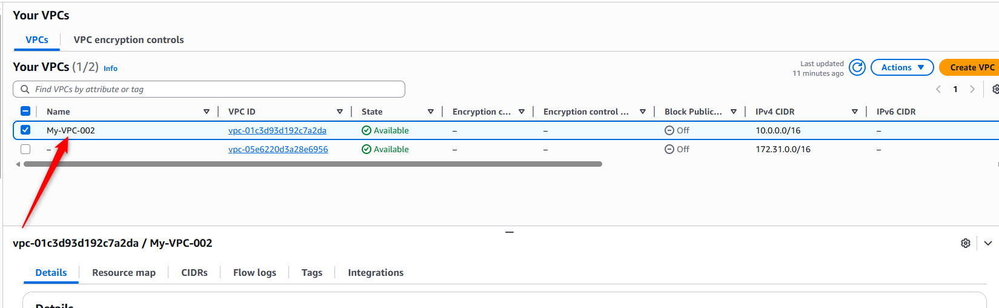

# 2. Configured 5 Security group.

   - Security group for ec2 instance connect endpoint EICE -  No inbound rules - limit ssh it to your vpc CIDR
   - Security group for application load balancer - select vpc - allow http & https for anywhere
   - Security group for Webserver - allow http & https, limit it to alb-sg - allow ssh, limit to eice.
   - Security group to migrate database db-sg - - select vpc - allow ssh, limit it to eice-sg
   - Security group for database - select MySQL limit it to webserver-sg - also allow MySQL, limit it dm-sg. 

 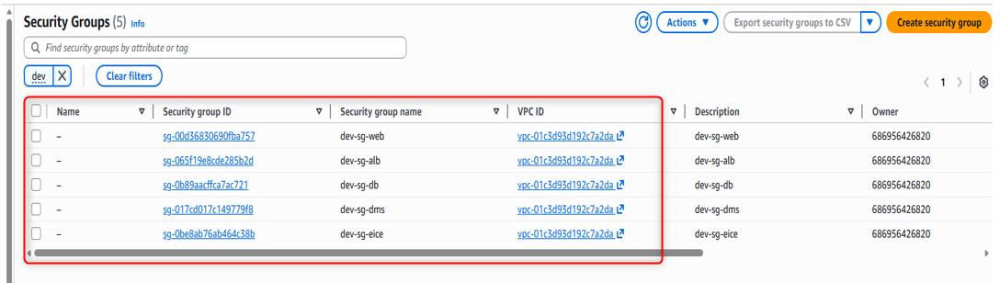

   
# 3. Create instance connect endpoint, Use eice-sg - Set outbound rule to VPC CIDR 

 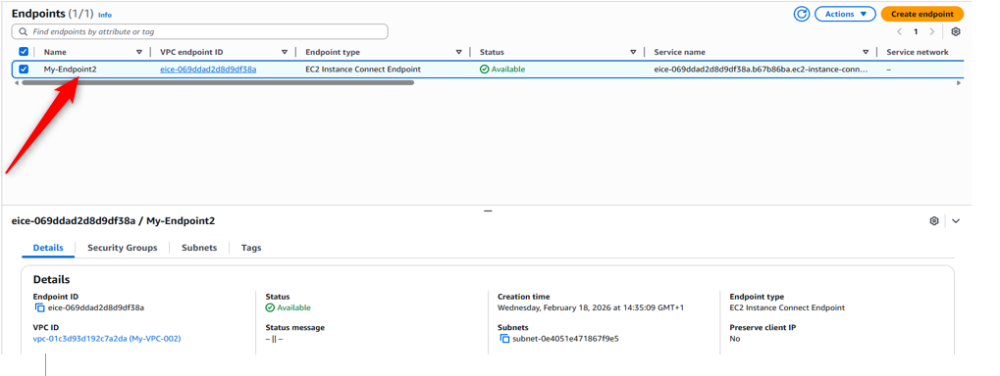

# 4. Create S3 bucket and upload the application code accordingly.

 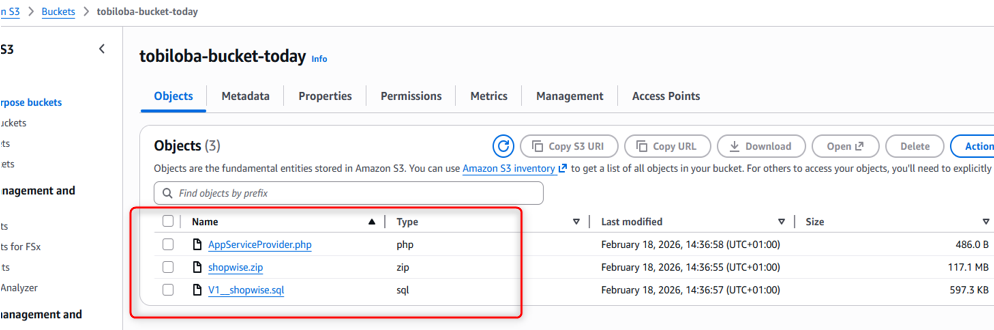

# 5. Create IAM Policy:
   Select S3 and grant: GetObject & S3: ListBucket
   Also, select Secret Manager and grant these permissions - GetSecretValue & DescribeSecret
 
 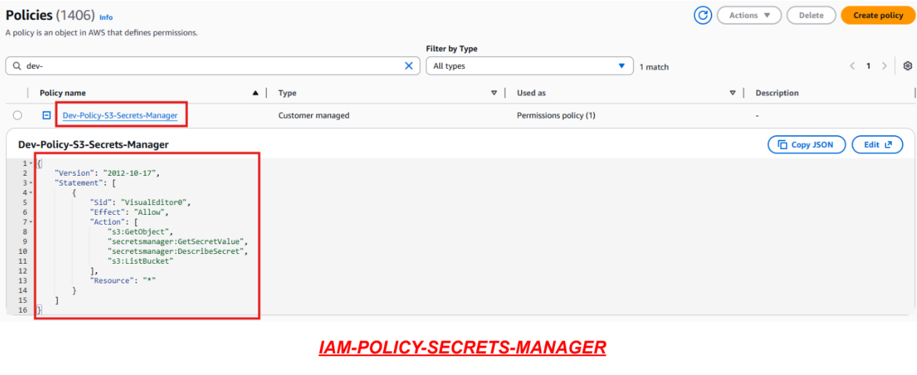

# 6. Create Role- select the policy you just created.
# 7. Create Subnet group and select two Availability Zone

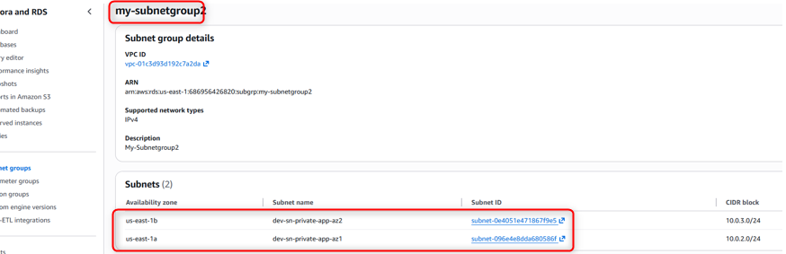

# 8. Launch RDS in private subnet - Select MySQL - Select your subnet group - Access restricted to application servers via security groups

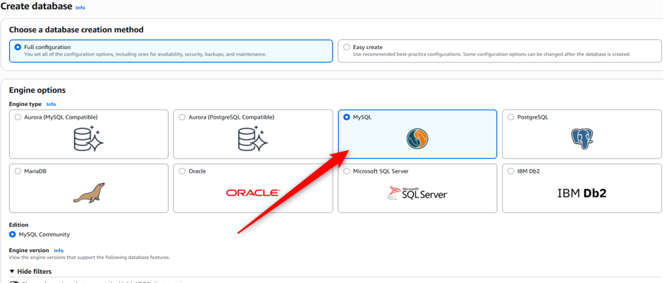 

# 9. Migrate data into RDS database.
   - Create Ec2 instance -- select without key pair -- select private AZ -- attach the role you created  earlier.
   - Connect to the ec2 instance using the management console and use the migration script attached to this repo.

  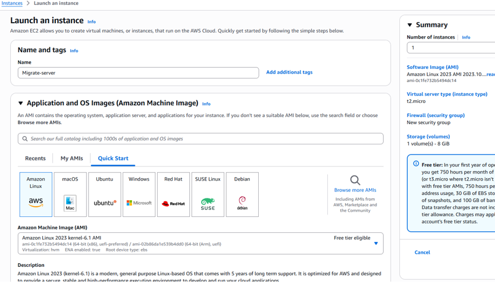 
  

  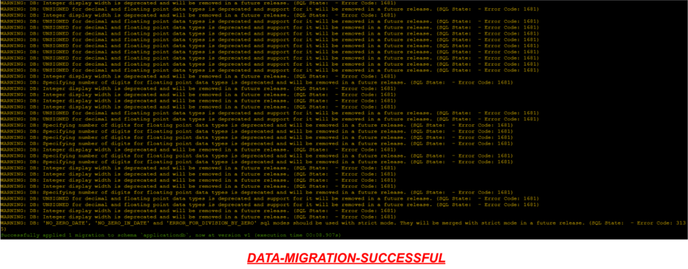 
  

  You can terminate the ec2 instance. 
  
# 10. Create another ec2 instance for your application -- select private AZ -- use web-sg  -- attach your role under instance profile.
 Use the Deployment script attached to this repo.

  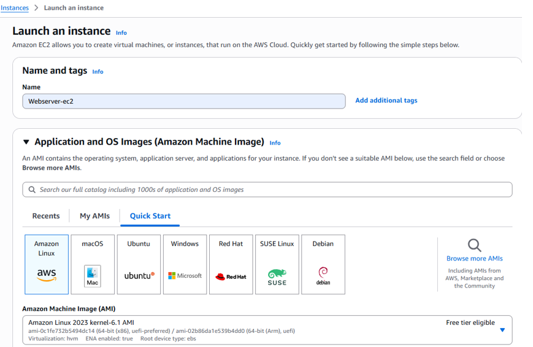 

# 11. Create Target group

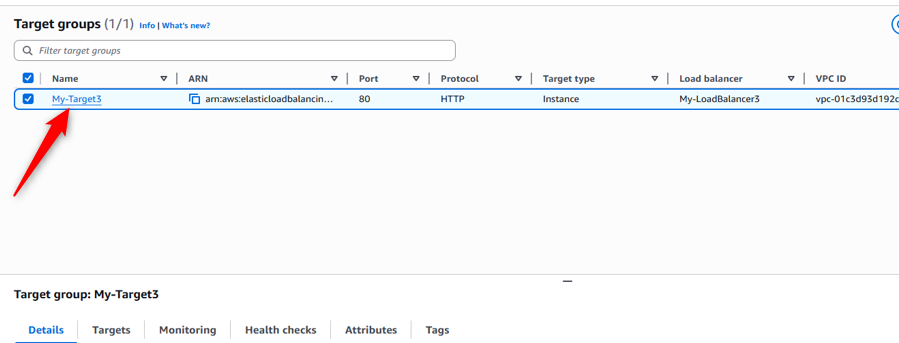 

# 12. Create Application Load balancer -- select the two AZ -- select public subnet for the two AZ -- Under Listener, select Redirect to URL and select full URL -- add another listener -- select https -- select target group -- under default SSL, select our certificate

 

# 13. Create Record in your Hosted zone under route 53 -- select region -- select Applciation and classic load balancer

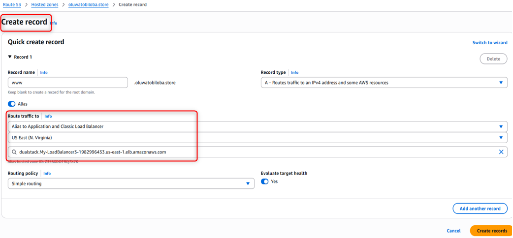 

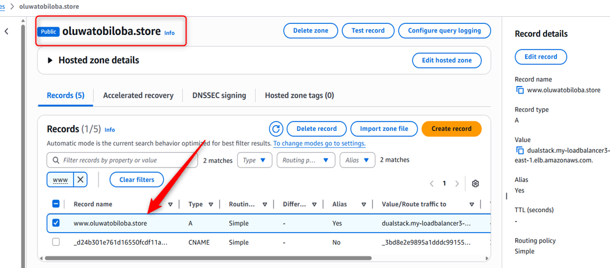 

# 14. Create AMI

 

# 15. Create Launch template --

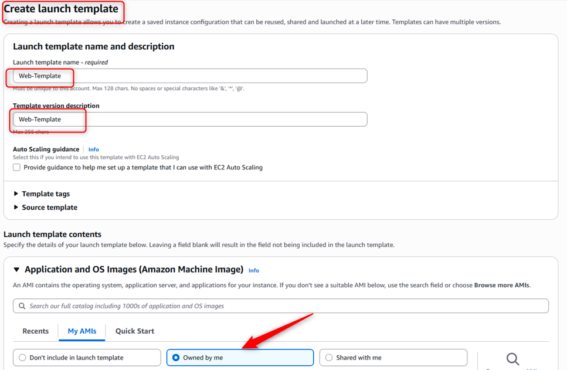

# 16. Configure Auto Scaling Group with launch template -- select your minimum and maximum capacity required.

# ✅ Project Outcome

✔ Successfully deployed a fully functional dynamic website
✔ Connected application to MySQL database
✔ Configured custom domain for public access
✔ Implemented secure AWS cloud architecture

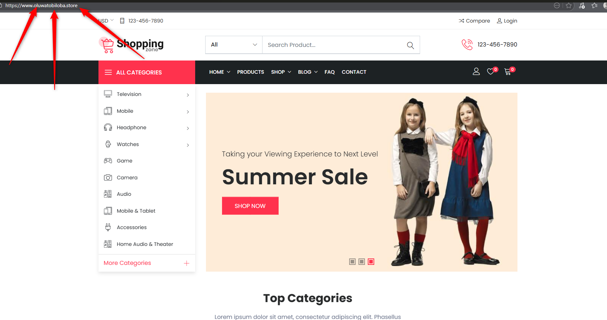 

# Key Challenge I Faced.

One major challenge was configuring secure communication between the web server and the MySQL database. Initially, the application couldn’t connect due to incorrect security group rules and database host configuration.

I resolved this by properly restricting port 3306 to allow access only from the web server and correcting the database connection settings within the application.
